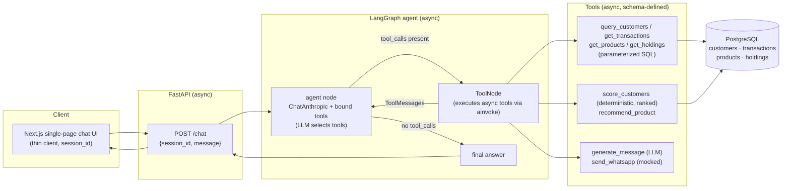

# Architecture — Conversational Agentic AI for Banking CRM

## Overview

A conversational agentic AI that assists a Relationship Manager (RM). The RM asks a
free-text question (e.g. *"Find high-value customers likely to convert for a personal
loan this month and generate personalized WhatsApp messages"*) and a tool-calling LLM
agent decides which tools to invoke, retrieves and scores data, recommends products,
and drafts personalized outreach.

The system is **four layers**:

```
Next.js chat UI  →  FastAPI /chat  →  LangGraph agent  →  Tools  →  PostgreSQL
   (thin client)     (async route)     (tool-calling      (async)    (async, asyncpg)
                                         loop, LLM picks
                                         the tools)
```

It is a **genuine tool-calling agent, not a fixed pipeline**: the LLM chooses which
tools to call based on the query, so different queries use different tool subsets.

## Architecture diagram



## Execution flow (canonical query)

*"Find high-value customers likely to convert for a personal loan this month and
generate personalized WhatsApp messages."*

1. **UI → API.** The chat UI POSTs `{session_id, message}` to `/chat`.
2. **API → agent.** The route maps `session_id` to a LangGraph `thread_id` and drives
   the compiled graph with `ainvoke`. Conversation state (the `messages` list) is held
   per thread by an in-memory checkpointer.
3. **Plan (LLM).** The agent node reads the query and decides the first tool call(s).
4. **Resolve product + candidates.** `get_products` resolves "personal loan" →
   `product_id` + eligibility; `query_customers` pulls a candidate pool with SQL-side
   filters (income band, active, exclude customers who already hold a personal loan).
5. **Gather signal.** For high-potential candidates the LLM calls `get_transactions`
   (current-month window) and `get_holdings`.
6. **Score (deterministic).** `score_customers` is called once with the candidate
   list and returns them **ranked by score**, each with `{score, band, reasons[]}` —
   reasons are human-readable, so the ranking is explainable, not a black box.
7. **Recommend.** `recommend_product` confirms the product fits each high scorer (or
   suggests an alternative).
8. **Generate (LLM).** `generate_message` drafts a WhatsApp message per selected
   customer, grounded in that customer's real attributes.
9. **(If asked) Send.** `send_whatsapp` dispatches — **mocked**, clearly labeled.
10. **Agent → API → UI.** The agent returns the shortlist + reasons + messages; the
    route serializes the reply; the UI renders it.

**Different queries take different paths** (proves it is not a fixed pipeline):
- *"Why did customer C00123 rank high for a personal loan?"* → `score_customers`
  with a single-id list only (it fetches that customer's holdings and transactions
  internally). No message generation, no send.
- *"Which product is the best cross-sell for C00123?"* → `get_holdings` +
  `recommend_product` only.
- *"List my top 10 customers by balance."* → `query_customers` only.

## Models

- Single Anthropic model for the whole system: **`claude-opus-4-8`** (Opus 4.8),
  configured via `ANTHROPIC_MODEL`. `generate_message` reads `ANTHROPIC_MESSAGE_MODEL`,
  which also defaults to `claude-opus-4-8` — a one-line config hook so either can be
  swapped via `.env` later with no code change. **No model factory or routing layer.**
- Accessed through `langchain-anthropic`'s `ChatAnthropic`. The API key comes from
  `ANTHROPIC_API_KEY` (env only, never hardcoded).
- **On Opus 4.8, `temperature` / `top_p` / `top_k` / `budget_tokens` return a 400** — we
  never pass them to `ChatAnthropic`. Thinking is adaptive; depth is controlled by
  `effort` (defaults to `high`), not a token budget.

## Architecture trade-offs

| Decision | Chosen | Rejected alternative | Why we chose it | What it costs us |
|---|---|---|---|---|
| **Concurrency model** | Async throughout (async SQLAlchemy + asyncpg, async tools/routes, `ainvoke`) | Synchronous SQLAlchemy + sync routes | FastAPI and LangGraph are async-native; non-blocking I/O keeps the event loop free under concurrent requests | More cognitive overhead and sharper failure modes (a single sync/blocking call poisons the loop); harder debugging; `pytest-asyncio` and async fixtures needed for tests |
| **Schema management** | Alembic with async env, initial migration autogenerated from models | One-shot `init.sql` / `create_all()` script | Versioned, reviewable, reversible schema evolution; models are the single source of truth; closer to production practice | Setup complexity (async `env.py` conversion, autogenerate review); an extra `alembic upgrade head` step before the app can run |
| **Database** | PostgreSQL (one-command local stack via docker-compose) | SQLite | Real banking-grade types, `date_trunc`/window functions for "this month" filtering, concurrent async access via asyncpg; docker-compose brings up Postgres and the backend together | Evaluator must run Docker (or a local Postgres); heavier than a single SQLite file |
| **Conversion scoring** | Deterministic heuristic scorer (rules → score + reasons) | Trained ML model | Assignment explicitly permits heuristics; transparent, explainable reasons satisfy the "no hardcoded outputs without reasoning" bar; no training data, no model serving, fully testable | Lower predictive sophistication; weights are hand-tuned rather than learned; won't capture nonlinear signal an ML model might |
| **Conversation memory** | In-memory `MemorySaver` (per `thread_id`) | Persistent checkpointer (Postgres/Redis) | Single-session conversational continuity is all the assignment needs; zero infra; swappable later behind the same checkpointer interface | History is lost on server restart; no cross-process/horizontal scaling of sessions |
| **Outreach delivery** | Mocked `send_whatsapp` (clearly labeled) | Real WhatsApp Business API integration | Assignment asks to *generate* messages, not operate a messaging gateway; avoids credentials, billing, phone-number provisioning, and approval workflows; keeps the demo self-contained | No proof of real delivery; the last-mile integration (auth, templates, rate limits, delivery receipts) is unexercised |
| **Frontend** | Minimal single-page Next.js chat client | Full-featured frontend (dashboards, auth, CRM views) | The deliverable is a working conversational system + demo, not a product UI; a thin client proves the API end-to-end without diluting effort | No rich visualization of shortlists/scores; not production-grade UX; limited interactivity beyond chat |
| **Scoring as a tool** | Deterministic Python tool returning score + reasons | Let the LLM estimate the score itself | Reproducible, auditable numbers; immune to prompt drift and hallucinated math; satisfies "meaningful tool usage" and avoids "hardcoded/unreasoned output" | Less flexible — adding a signal means a code change, not a prompt tweak; the LLM can't creatively weigh factors outside the rules |
| **Data tool granularity** | Parameterized SQL query tools (filter in SQL) | Whole-table fetch tools (filter in LLM context) | Filtering/aggregation runs in the DB where it's fast and exact; keeps token usage and context bloat low; prevents the LLM from reasoning over thousands of rows | More tool surface area and parameter schemas to design/maintain; the LLM must choose correct filters rather than receiving everything |
| **Agent control flow** | Tool-calling LangGraph loop (LLM selects tools per query) | Fixed pipeline running every step every query | Genuinely "agentic": different queries use different tool subsets (e.g. "why did X rank high?" calls only the scorer); avoids wasted work and the disqualifying "fixed pipeline" anti-pattern | Less predictable execution path; harder to test exhaustively; depends on LLM tool-selection quality and a well-crafted system prompt |
| **LLM provider/model** | Single model `claude-opus-4-8` via `ChatAnthropic`, config hook for swap | Tiered router (cheap model routes, strong model generates) | At this scale a router adds a factory, two cache prefixes, and a more complex story for negligible cost saving; one model keeps the design clean and demoable | Higher per-token cost than a cheaper routing model; no per-step cost optimization |

## Limitations

- Heuristic scorer, not a learned model — weights are hand-tuned.
- Scorer bands: `ineligible` (already holds the product, or below its income/credit minimum) is a distinct status, separate from a graded `low`; `low`/`medium`/`high` apply only to eligible customers.
- In-memory conversation memory — does not survive a server restart.
- `send_whatsapp` is mocked — no real delivery.
- Synthetic data — realistic in shape, but not real customer behavior.
- Single-tenant, no auth, no rate limiting — out of scope for this assignment.
- PII / data-access control is an authorization concern (out of scope): the single-tenant system trusts the RM principal, so the agent's guardrails are limited to instruction-override resistance and role-scoping, not blocking the RM from legitimate customer data.
