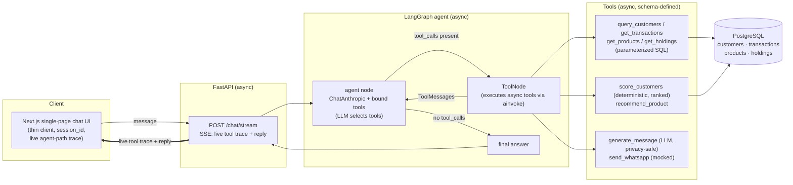

# Banking CRM — Conversational Agentic AI

A conversational agentic AI that assists a bank Relationship Manager (RM). The RM
asks a free-text question — e.g. *"Find high-value customers likely to convert for
a personal loan this month and generate personalized WhatsApp messages"* — and a
tool-calling LLM agent decides which tools to invoke, retrieves and scores data,
recommends products, and drafts personalized outreach. It is a **genuine
tool-calling agent, not a fixed pipeline**: the LLM chooses the tools per query, so
different questions exercise different tool subsets.

The chat UI is **transparent**: under every answer it shows the **agent path** — the
exact tools the agent called, in order, with their inputs and a short result summary —
and over the streaming endpoint that trace appears **live**, tool by tool, as the
agent works.

## Architecture

Four layers — a thin Next.js chat client over an async FastAPI API, which drives a
LangGraph tool-calling agent whose tools run async, parameterized SQL against
PostgreSQL.



The UI talks to the agent over **`/chat/stream`** (Server-Sent Events): as the agent
runs, each tool call/result is emitted as an event so the trace renders live, then the
reply. A non-streaming **`POST /chat`** endpoint (same agent, full result in one JSON
response) is also available for curl / programmatic use.
Full detail (diagram, models, rationale) lives in
[docs/ARCHITECTURE.md](docs/ARCHITECTURE.md); the build sequence is in
[docs/PLAN.md](docs/PLAN.md).

## Execution flow

A query maps to a LangGraph `thread_id`; the compiled graph is driven with
`ainvoke`/`astream`, and per-thread conversation state is held by an in-memory
checkpointer (multi-turn memory). The agent node reads the message, decides the first
tool call(s), loops through the `ToolNode` as needed, and returns once it emits no
further tool calls.

Canonical query — *"Find high-value customers likely to convert for a personal loan
this month and generate personalized WhatsApp messages"*:

1. `get_products` resolves "personal loan" → `product_id` + eligibility.
2. `query_customers` pulls a candidate pool with **SQL-side** filters (income band,
   active, exclude those who already hold a personal loan).
3. `get_transactions` (current-month window) and `get_holdings` gather signal.
4. `score_customers` is called **once** with the candidate list and returns them
   **ranked**, each with `{score, band, reasons[]}` — reasons are human-readable, so
   the ranking is explainable, not a black box.
5. `recommend_product` confirms fit (or suggests an alternative).
6. `generate_message` drafts a per-customer WhatsApp message grounded in safe,
   non-sensitive details; `send_whatsapp` dispatches only if asked (**mocked**).

**Different queries take different paths** — proof it is not a fixed pipeline:

- *"Show me a top personal-loan prospect and explain why they rank so high."* →
  `get_products` + `query_customers` + `score_customers` (explainability; no outreach).
- *"What's the best product to cross-sell to my highest-balance customer?"* →
  `query_customers` + `recommend_product` only.
- *"List my top 10 customers by balance."* → `query_customers` only.

## Observability — the agent path

Every assistant reply carries an **execution trace** (the "agent path"): the ordered
tools the agent chose, each with its arguments and a short result summary
(e.g. `query_customers {min_income: …} → 25 rows`, `score_customers → ranked, top 100`,
`generate_message → message (274 chars)`), plus total elapsed time. Repeated calls to
the same tool (e.g. one `generate_message` per customer) are grouped (`×N`) with a
sub-row per call.

- Over **`POST /chat`** the trace is returned alongside the reply (`tool_calls[]` with
  `{name, args, result}`).
- Over **`POST /chat/stream`** (SSE) the same trace streams **live** — "Agent is
  processing…" while tools appear one by one, then the full reply.

This makes the agent's reasoning auditable: you can see exactly which tools ran, with
what inputs, and what each returned.

## Tool design and usage

The key principle: **discrete, schema-defined tools — the LLM picks *which* tools to
call; the tools do the actual work.** Data tools push filtering and sorting down into
SQL (fast, exact, low token cost) instead of dumping tables into the model's context.
Numeric scoring is a deterministic Python tool, never the LLM's own estimate, so the
numbers are reproducible and auditable.

| Tool | Purpose |
|---|---|
| `query_customers` | Candidate pool with SQL-side filters: income band, balance, segment, city, `exclude_product_id` / `holds_product_id`, `customer_since`, `order_by` (whitelisted), `limit`. |
| `get_transactions` | A customer's transactions within a month window. |
| `get_products` | Product catalog + eligibility; resolves a product name → id. |
| `get_holdings` | What a customer already holds (drives cross-sell and exclusion). |
| `score_customers` | **Deterministic** batch scorer: takes `(customer_ids, product_id)`, returns the list **ranked** with `{score, band, reasons[]}`. Bands: `high`/`medium`/`low` for eligible customers, plus a distinct `ineligible` status. |
| `recommend_product` | Best-fit product(s) for a customer, with reasoning. |
| `generate_message` | LLM-drafted outreach, **privacy-safe**: personalized only on non-sensitive details (first name, city, relationship tenure) — never balance, income, or credit score. |
| `send_whatsapp` | **Mocked** dispatch, clearly labeled — generation, not delivery. |

## Key design decisions

- **Genuine tool-calling agent, not a fixed pipeline.** A LangGraph `StateGraph`
  (agent node ↔ `ToolNode`, conditional edge on tool calls) lets the LLM choose the
  tool subset per query — the divergent paths above are the proof.
- **Deterministic scoring as a tool.** Conversion likelihood is computed by rules
  returning `score + reasons`, not estimated by the LLM — reproducible, explainable,
  immune to prompt drift.
- **Transparency by default.** The agent's tool calls/results are surfaced as a trace
  on every reply, and streamed live over SSE — the reasoning is visible, not hidden.
- **Privacy-safe outreach.** Sensitive financials are never fed to the message model
  or quoted in customer-facing messages.
- **Filtering in SQL, not in the model.** Parameterized query tools keep token usage
  and context bloat low and the math exact.
- **Async throughout.** Async SQLAlchemy + asyncpg, async tools/routes,
  `ainvoke`/`astream` — FastAPI and LangGraph are async-native.
- **Single model, config-swappable.** One Anthropic model (`claude-opus-4-8`) for the
  whole system, with a one-line env hook to swap the agent or message model. No
  `temperature`/`top_p`/`top_k`/`budget_tokens` — they 400 on Opus 4.8.

## Trade-offs and limitations

| Decision | Chosen | Rejected | Why | What it costs |
|---|---|---|---|---|
| **Concurrency** | Async throughout (asyncpg, async tools/routes, `ainvoke`) | Sync SQLAlchemy + sync routes | Non-blocking I/O; framework-native | Sharper failure modes; async test setup |
| **Schema** | Alembic async migrations | One-shot `create_all()` / `init.sql` | Versioned, reversible, models are source of truth | An extra `alembic upgrade head` step |
| **Scoring** | Deterministic heuristic (rules → score + reasons) | Trained ML model | Transparent, explainable, no training data | Hand-tuned weights; no learned nonlinear signal |
| **Memory** | In-memory `MemorySaver` per `thread_id` | Persistent checkpointer (Postgres/Redis) | All a single session needs; zero infra; swappable | Lost on restart; no horizontal scaling |
| **Outreach** | Mocked `send_whatsapp` | Real WhatsApp Business API | Asks to *generate*, not operate a gateway | No proof of real delivery |
| **Local environment** | docker-compose (Postgres + backend) | Manual local install only | One-command, reproducible setup | Requires Docker (manual host setup remains available) |
| **Frontend** | Minimal Next.js chat client | Full CRM UI | Proves the API end-to-end without diluting effort | No rich shortlist/score visualization |
| **Scoring as a tool** | Deterministic Python tool | LLM estimates the score | Reproducible, auditable; no hallucinated math | Adding a signal is a code change, not a prompt tweak |
| **Data tools** | Parameterized SQL (filter in DB) | Whole-table fetch (filter in context) | Fast, exact, low token cost | More tool/parameter surface to design |
| **Control flow** | Tool-calling LangGraph loop | Fixed pipeline every query | Genuinely agentic; avoids the disqualifying anti-pattern | Less predictable; harder to test exhaustively |
| **Model** | Single `claude-opus-4-8` + swap hook | Tiered cheap/strong router | Clean, demoable; negligible saving at this scale | Higher per-token cost than a routing model |

**Limitations**

- Heuristic scorer, not a learned model — weights are hand-tuned.
- In-memory conversation memory — does not survive a server restart.
- `send_whatsapp` is mocked — no real delivery.
- Synthetic data — realistic in shape, not real customer behavior.
- Single-tenant, no auth, no rate limiting — out of scope.
- PII / data-access control is an **authorization** concern (out of scope): the
  single-tenant system trusts the RM principal, so the agent's guardrails are limited
  to instruction-override resistance and role-scoping, not blocking the RM from
  legitimate customer data. Outreach messages are nonetheless kept free of sensitive
  financial figures.

The agent was **behaviorally stress-tested end-to-end** across a range of queries
(canonical, single-customer explainability, cross-sell, upgrade, off-topic, and
injection attempts) and the system prompt was tuned from the findings.

## Quickstart

The fastest path is Docker (Postgres + backend in one command); the frontend runs on
the host.

1. **Backend + database (Docker)** — see [backend/README.md](backend/README.md):
   ```bash
   cp backend/.env.example backend/.env     # fill ANTHROPIC_API_KEY
   docker compose up --build                # http://localhost:8000 (OpenAPI docs at /docs)
   ```
   This brings up PostgreSQL and the API (migrated + seeded). A manual host/venv setup
   (and how to run the tests) is documented in the backend README.
2. **Frontend** — see [frontend/README.md](frontend/README.md):
   ```bash
   cd frontend && npm install
   cp .env.example .env.local               # NEXT_PUBLIC_API_BASE_URL=http://localhost:8000
   npm run dev                              # http://localhost:3000
   ```

An Anthropic API key is required to run the agent live.

## Code quality

- **Backend:** [Ruff](https://docs.astral.sh/ruff/) for linting **and** formatting
  (`ruff check` / `ruff format`).
- **Frontend:** ESLint (`next lint`) + Prettier (`npm run lint` / `npm run format`).
- **Pre-commit hooks** (`.pre-commit-config.yaml`) run both on every commit —
  `pip install pre-commit && pre-commit install`.

See the backend/frontend READMEs for the exact commands.

Deep dives: [docs/ARCHITECTURE.md](docs/ARCHITECTURE.md) ·
[docs/PLAN.md](docs/PLAN.md)
